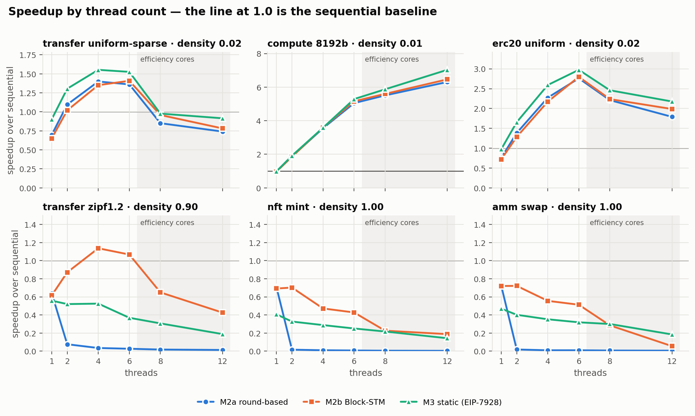
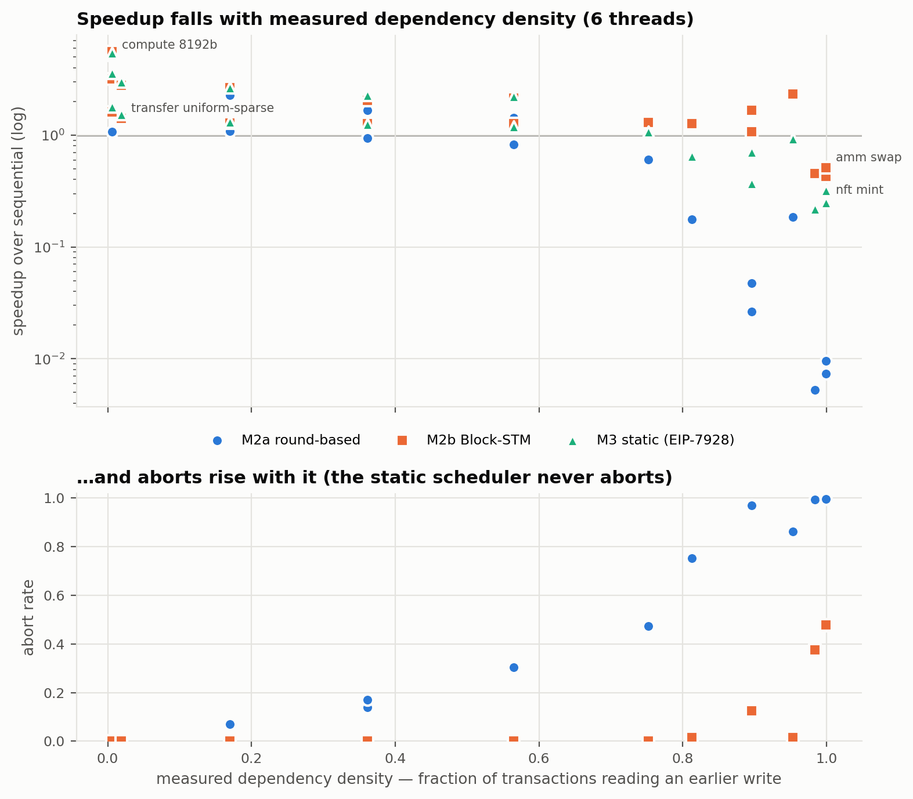
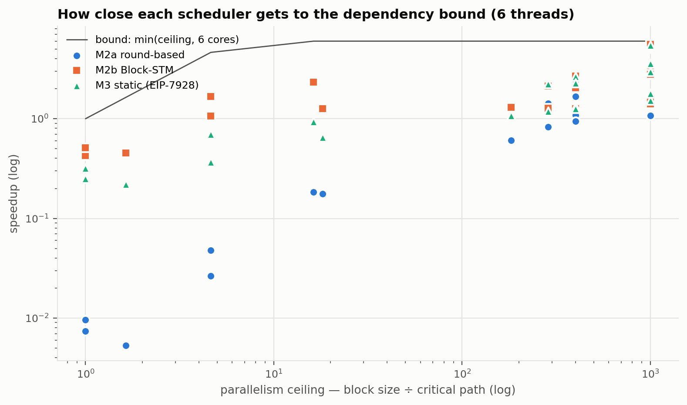
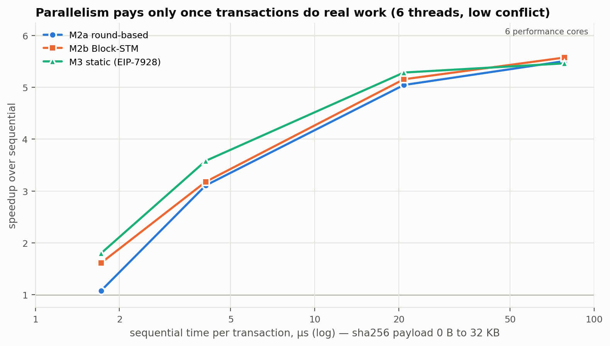
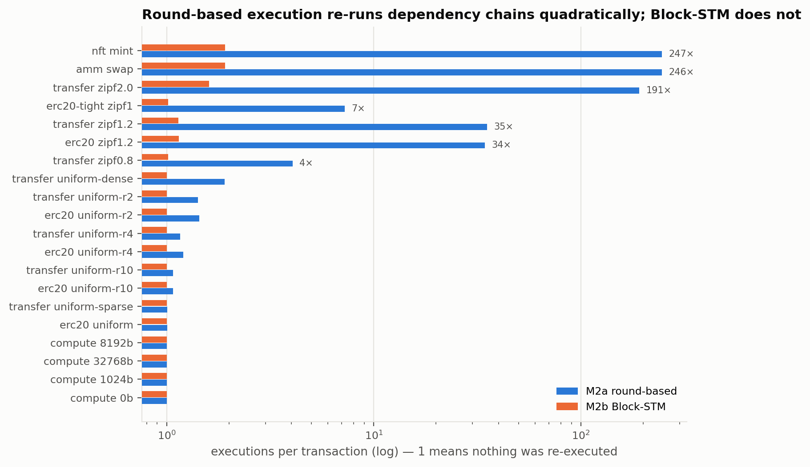
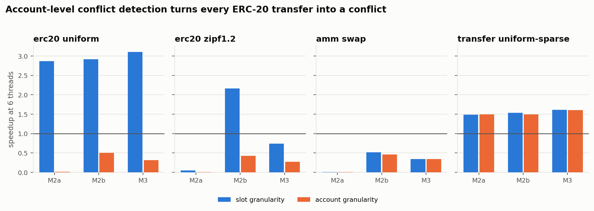
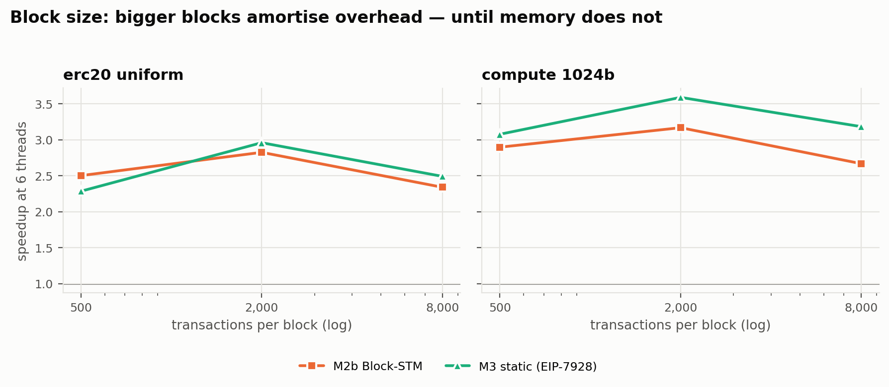
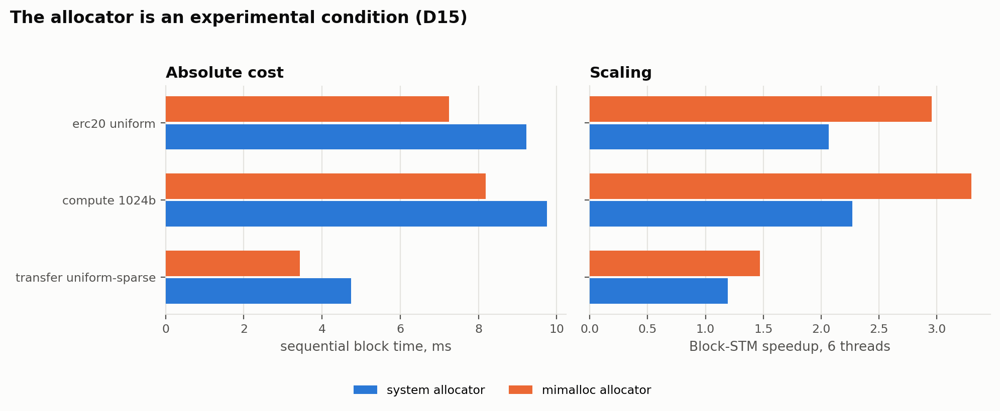

# Parallel Transaction Execution for EVM Workloads — Report

SC6109 Blockchain Scalability · Course project, Option 5

## Summary

We built a parallel execution engine for EVM transactions — real bytecode
through revm, real threads — with three schedulers: round-based optimistic
execution (M2a), collaborative Block-STM (M2b), and static scheduling from
declared access sets in the style of EIP-7928 (M3). All three reproduce the
sequential result exactly across thousands of seeded blocks per workload, and
the sequential engine itself agrees with an Anvil node on nine workloads.

**Parallel execution helps when three things are true at once:** transactions
are mostly independent, each does enough work to cover the cost of
coordinating it, and there are real cores to run them on. On ERC-20 transfers
among a large population Block-STM runs 2.8× faster than sequential on six
performance cores; on compute-heavy transactions, 5.6× — 92% of linear.

**It does not help — it hurts — when any one of them fails:**

| Condition | Measured, Block-STM, 6 threads |
| --- | --- |
| A long dependency chain (NFT mint, one AMM pool: critical path = block) | **0.43–0.51×** — slower than sequential |
| Too little work per transaction (plain ETH transfer, ~1.6 µs) | 1.4× at best, however independent |
| Conflicts detected per account instead of per slot | ERC-20: **2.9× → 0.5×** — every transfer collides in the token contract |
| Threads beyond the six performance cores | light workloads *lose* speed: 1.4× at 6 threads, 0.8× at 12 |

Dependency density alone does not decide the outcome. Blocks where 75% of
transactions depend on an earlier one still run at 1.3× when chains are short;
what collapses speedup is critical-path length. And scheduler design matters as
much as workload: on the same chains, round-based execution re-runs each
transaction ~250 times and falls to 0.01×, where Block-STM parks waiting
transactions and runs each fewer than twice.

---

## 1. What the brief asked for, and where it is

| Brief requirement | Where it is met |
| --- | --- |
| A transaction scheduler that identifies non-conflicting transactions | Three: round-based optimistic (`sched/rounds.rs`), collaborative Block-STM (`sched/blockstm/`), and static scheduling from declared access sets (`sched/static_sched.rs`) |
| Parallel or pseudo-parallel execution for selected workloads | Real parallelism on real EVM bytecode: revm 41 embedded as a library, rayon thread pools, Solidity contracts compiled by Foundry |
| A conflict-detection rule based on account access, storage-slot access, or read/write sets | Read/write sets captured at the database boundary, detected at **slot** or **account** granularity, and the two compared as an experiment (§6.5) |
| Throughput and execution time against sequential processing | Every scheduler, twenty workloads, one to twelve threads (§6) |
| A report explaining when parallel execution helps and when it does not | §7 |
| *Hint:* determinism and rollback when conflicts occur | §3 and §4: the determinism argument, the abort/re-execute path, and how both are tested |
| *Hint:* links to Aptos-style parallelism, SVM-style execution, parallel EVM efforts | §8 |

---

## 2. System design

### 2.1 One execution path

All three parallel schedulers and the sequential baseline execute transactions
through the same function (`exec::execute`). They differ only in which view of
state they hand the EVM and what they do with the result. One path means one
place for an execution bug to live, and the sequential baseline — the
denominator of every speedup — cannot be quietly cheaper than what it is
compared against.

State access is a stack of decorators:

```
revm  →  WrapDatabaseRef  →  ReadRecorder<V>  →  V: StateView  →  BaseState
                                                  ├── MVView     (parallel engines)
                                                  └── SimpleView (sequential, static)
```

`ReadRecorder` is the only type in the crate that implements revm's
`DatabaseRef`, so no read can reach the EVM without being logged. All five of
revm's read methods are implemented explicitly, including the one revm supplies
a default for, because a defaulted method is not a compile error to omit.

### 2.2 What is a conflict

A transaction's **read set** is every location the EVM loaded: account info
(balance, nonce, code hash) and storage slots. Its **write set** is every
location whose value it *changed* — not every location revm marks as touched.
The distinction matters more than it looks: every call to a contract touches the
contract's account without changing it, and treating touched as written made
every transaction to the same contract conflict with every other one. Account
existence follows EIP-161: an account left empty does not exist, so a call to a
precompile — absent before, empty after — changes nothing.

Two rules then apply at one of two granularities:

- **Slot granularity** — one location per storage slot, one per account's info.
- **Account granularity** — one location per account; any access to any slot of
  an account collides with any other.

### 2.3 The block beneficiary

Every transaction pays gas to the block beneficiary, which would make every
transaction write one shared account and serialise every block. Measured on the
engine: the beneficiary is in the write set even at zero gas price. It is
therefore exempt from conflict detection. Views serve its pre-block balance,
each transaction's increase is recorded as a delta, and the deltas are summed at
commit. This is sound because the balance is a commutative accumulator, not a
read-modify-write dependency — and only while no transaction does anything to
the beneficiary except pay it, which the schedulers assert.

### 2.4 Multi-version memory

For every location, a map from transaction index to the value that transaction
wrote. Transaction *j* reads the entry with the greatest index below *j*, or
falls through to pre-block state. Each read is recorded with the **version** it
resolved to — (writer, incarnation) or "base" — and validation re-resolves every
read and compares versions, not values. An unchanged version implies an
unchanged value; a changed version is a conflict even if the value happens to
match. That costs occasional spurious aborts and buys a check that cannot be
fooled.

When a transaction aborts, its writes are marked **ESTIMATE**. A reader that
reaches one learns which transaction to wait for; a validator that reaches one
fails.

### 2.5 The three schedulers

**M2a — round-based optimistic.** Execute every pending transaction in parallel,
validate everything at or after the lowest pending index, re-execute what
failed, repeat. Execution and validation never overlap, so validation always
sees a stable store. The lowest failing transaction in a round has only final
predecessors, so it passes next round: the loop ends within *n* rounds, and the
scheduler asserts that bound.

**M2b — Block-STM.** The collaborative scheduler of Gelashvili et al. Two atomic
indices hand out execution and validation tasks, lower validation first. An
execution that reads an ESTIMATE is *parked* on the transaction that wrote it
and re-queued when that transaction finishes — no spinning, no waiting
primitive. A validation abort marks the writes as estimates and schedules
revalidation of everything above.

**M3 — static scheduling from access lists (an EIP-7928 prototype).** Access sets
are derived by one sequential execution, as an EIP-7928 block builder would
derive a block access list. Each transaction takes the lowest *level* after
every earlier transaction it conflicts with (read-after-write, write-after-write
or write-after-read). A level runs in parallel against the state lower levels
committed. No speculation and no aborts — but the time to derive the access list
is excluded from its measurement and reported separately, because under
EIP-7928 the builder pays it once for every validator.

---

## 3. Determinism

The parallel engines must produce exactly the state sequential execution
produces. The argument, for the optimistic engines:

> A transaction's read set records the exact version each read resolved to.
> Validation fails unless every read still resolves to the same version. A
> transaction that survives validation therefore observed precisely the state
> sequential execution at its index would have shown it. Every transaction must
> pass validation before the block completes, so the committed state — for each
> location, the entry of the highest-index writer — is the sequential state.

For the static scheduler: transactions in one level do not conflict, and every
conflicting predecessor is in a lower, already-committed level, so each
transaction reads exactly the values sequential execution would show it.

The argument is only as good as the read sets. A location the EVM read but the
recorder missed is one validation never re-checks, and the failure it causes is
probabilistic — a divergence on one slot, on some seeds, at high thread counts.
That is why correctness is tested, not just argued.

---

## 4. Correctness evidence

### 4.1 Differential testing

Every parallel scheduler is compared slot-for-slot against an **independent**
sequential engine. The sequential path deliberately does not reuse the
multi-version store: a bug in shared machinery would corrupt both sides
identically and the comparison would pass. The harness itself is tested against
a deliberately broken scheduler, to prove it can fail.

Full gates, run with `cargo test --release -- --ignored`:

| Scheduler | Workloads | Seeds | Threads |
| --- | --- | --- | --- |
| M2a round-based | 4 transfer distributions, compute, 5 contract workloads | 1,000 each | 2, 4, 6, 8, 12 |
| M2b Block-STM | the same | 1,000 each | 2, 4, 6, 8, 12 |
| M3 static | 8 workloads, fees on and off | 500 | 2, 4, 6, 8, 12 |
| Account granularity | 5 workloads, both optimistic engines | 300, plus a 400-seed stress run at 8–16 threads | 2–16 |

All pass. The benchmark runner additionally diffs every timed run against
sequential and refuses to record a timing that disagrees.

### 4.2 Cross-validation against a real node

The sequential engine is in turn checked against Anvil, a full EVM node. Nine
workloads — transfers, transfers paying fees, compute, ERC-20, ERC-20 with 128
of 300 transfers reverting, NFT mint, AMM swaps, and zero-value calls to empty
accounts — are installed in a fresh Anvil, replayed one transaction per block,
and compared on every account's balance, nonce and code, every storage slot,
and every transaction's success or revert. **9/9 agree**
(`results/anvil_crosscheck.txt`).

What it cannot check, stated plainly: whether an empty account exists. EIP-161
makes empty and absent accounts indistinguishable to every RPC and every
opcode; only the state root differs, and Anvil's root includes accounts ours
does not model.

### 4.3 Testing the tests

A green suite shows the tests pass, not that they can fail. The
correctness-critical code was mutation-tested: bugs were injected one at a time
and the suite run against each. Examples, all caught:

| Injected bug | How it surfaced |
| --- | --- |
| Validation ignores account reads | Differential disagreement |
| Re-execution leaves stale writes in place | Differential disagreement on the tight ERC-20 workload — the only workload whose write set depends on what it reads |
| Abort does not revalidate higher transactions | Scheduling-property test |
| A new-location write does not revalidate higher transactions | Scheduling-property test — added after the first version of the tests let this one through |
| Parked transaction's wakeup can be lost | Final-state check: a transaction left parked forever |
| Aborts do not mark writes as estimates | Differential disagreement — so ESTIMATE is a correctness mechanism, not an optimisation |
| Coarse reads versioned by the exact slot | Round scheduler exceeds its proven bound |

Three real defects were found by the tests rather than by mutation: generated
accounts landing on precompile addresses (15% of a block silently calling
ecrecover and friends); touched-but-unchanged accounts counted as writes (every
contract workload serialised through the contract's account); and a read race
under account granularity that let a stale nonce survive validation, found by a
stress test after appearing once in a full run.

---

## 5. Experimental method

**Machine.** Apple M3 Pro, 6 performance and 6 efficiency cores, 18 GB, macOS
26.5. One to six threads are the primary result; eight and twelve are reported
and shaded, because they run partly on efficiency cores and measure the chip as
much as the scheduler.

**Build.** Rust 1.97, revm 41.0.0 (pinned), `--release`, mimalloc as the global
allocator for every scheduler including the baseline (§6.7 shows why and what
it changes).

**Blocks.** 2,000 transactions per block for the main sweep, plus a block-size
sweep at 500, 2,000 and 8,000. One seed (2026) per workload; five timed runs
after one discarded warmup; medians reported, with minimum and maximum in the
CSV.

**What is timed.** Executing the block and producing its final state. Thread
pools, per-block allocations and the final state snapshot are outside the
timed region, for every scheduler alike. The static scheduler's access-set
derivation — a full sequential execution — is excluded and reported separately
as `prep_ms`.

**Verification.** Every timed parallel run's final state is compared with
sequential's before the timing is kept. No number in this report comes from a
run that disagreed.

**Workloads** (twenty in the main sweep), placed by their *measured*
dependency structure — computed from an actual sequential execution, not from
generator parameters:

| Family | Settings | Dependency density | Critical path |
| --- | --- | --- | --- |
| ETH transfers, uniform recipients | account-to-block ratio 100, 10, 4, 2, 1 | 0.02 → 0.75 | 2 → 11 |
| ETH transfers, Zipf recipients | exponent 0.8, 1.2, 2.0 | 0.81 → 0.98 | 110 → 1,217 |
| sha256 precompile calls | payload 0, 1, 8, 32 KB | 0.01 | 2 |
| ERC-20 transfers, uniform | ratio 100, 10, 4, 2 | 0.02 → 0.57 | 2 → 7 |
| ERC-20 transfers, Zipf 1.2 | | 0.90 | 432 |
| ERC-20, every account funded for one transfer | 128 of 300 revert, order-dependent | 0.95 | 123 |
| NFT mint (one `totalSupply` counter) | | 1.00 | 2,000 |
| AMM swaps on one pool | | 1.00 | 2,000 |

Raw data: `results/final/sweep.csv`, `alloc_*.csv`, each with a `.meta.txt`
recording commit, allocator, toolchain and core layout.

---

## 6. Results

### 6.1 Scaling with threads



Three shapes, one per regime:

- **Independent and heavy** (compute, 8 KB): near-linear, 5.2× at six threads —
  and still climbing on efficiency cores, to 6.5× at twelve. Every scheduler
  looks the same, because none of them has anything to coordinate.
- **Independent and light** (transfers, ERC-20 among a large population): a
  real gain that peaks at four to six threads — 1.4–1.5× for ETH transfers,
  2.8–3.0× for ERC-20 — then *falls* once threads land on efficiency cores.
- **Dependent** (Zipf 1.2 transfers, NFT mint, AMM): Block-STM holds just above
  1× at moderate chains and drops below it on full chains; the static scheduler
  sits below 1× throughout; round-based execution collapses to near zero.

At one thread, Block-STM runs at between 0.60× of sequential (light transfers)
and 0.99× (the heaviest compute). That is the price of the machinery —
versioned reads, read-set capture, validation — and it is roughly a fixed cost
per transaction: large next to a 1.6 µs transfer, negligible next to 78 µs of
hashing. Every parallel gain has to pay it back first, which is why §6.3 finds
what it does.

### 6.2 Dependency density and critical path



Up to a density of 0.75 the schedulers barely separate. Under Block-STM, ETH
transfers hold 1.3× all the way to 0.75 — blocks in which three quarters of
transactions depend on an earlier one — and ERC-20 transfers hold 2.1× at 0.56,
because the chains stay short: critical path 11 or less. Past that, what matters is chain length, and the schedulers part
ways sharply:

| Workload | Density | Critical path | M2a | **M2b** | M3 |
| --- | --- | --- | --- | --- | --- |
| transfer, uniform r=1 | 0.75 | 11 | 0.60× | **1.29×** | 1.07× |
| transfer, Zipf 0.8 | 0.81 | 110 | 0.18× | **1.26×** | 0.65× |
| transfer, Zipf 1.2 | 0.90 | 432 | 0.03× | **1.07×** | 0.37× |
| ERC-20, Zipf 1.2 | 0.90 | 432 | 0.05× | **1.67×** | 0.70× |
| transfer, Zipf 2.0 | 0.98 | 1,217 | 0.01× | **0.45×** | 0.22× |
| NFT mint | 1.00 | 2,000 | 0.01× | **0.43×** | 0.25× |
| AMM swap | 1.00 | 2,000 | 0.01× | **0.51×** | 0.32× |

*(six threads; the best Block-STM figure on a full chain is 0.70–0.72× at two
threads — more threads only add contention to a serial chain.)*



The two transfer and ERC-20 Zipf 1.2 rows have **identical** dependency
structure — same generator, same seed, same critical path — and differ only in
work per transaction. Block-STM gets 1.07× from one and 1.67× from the other.
Density is not a sufficient description of a workload.

### 6.3 Work per transaction



With conflicts held near zero, speedup at six threads is set by how long each
transaction takes: 1.6× for an empty precompile call (~1.6 µs), 3.2× at 1 KB
(~4 µs), 5.2× at 8 KB (~21 µs), 5.6× at 32 KB (~78 µs) — 92% of the six
performance cores. A plain ETH transfer is on the wrong side of this curve no
matter how independent the block is.

### 6.4 Scheduler design: re-execution



Round-based execution confirms at least one more transaction per round and
re-runs everything above it, so on a chain its work is quadratic: 191 executions
per transaction on Zipf 2.0 transfers, 247 on NFT mint and 246 on the AMM pool. Block-STM parks
a transaction that reads an aborted write until the writer finishes, instead of
letting it run on a value about to change; it executes each transaction 1.6–1.9
times on the same chains. At low density the two are indistinguishable (1.0–1.4
executions per transaction), which is why M2a looked adequate until it met a
chain.

Over the whole sweep Block-STM parked transactions about 80,000 times, and 289
executions were refused by the EVM mid-flight — a stale nonce read — and
recovered by validation, exactly the path the correctness tests single out.

### 6.5 Conflict granularity: false conflicts



Every ERC-20 balance lives in the token contract's storage. Detect conflicts
per slot and transfers between different holders are independent; detect them
per account and every transfer collides in one account:

| ERC-20, uniform, 6 threads | slot | account |
| --- | --- | --- |
| M2a round-based | 2.87× | 0.01× (1,751 rounds) |
| M2b Block-STM | 2.92× | 0.50× (1,752 aborts) |
| M3 static | 3.10× | 0.31× (2,000 levels) |

The AMM pool is unaffected — it is a total conflict at either granularity — and
ETH transfers, whose accounts hold no storage, are identical under both: a
control that behaves as it should. Account-level detection is what an
account-list scheduler like Sealevel's gives you on the EVM, and on contract
workloads it throws the parallelism away.

### 6.6 Block size



From 500 to 2,000 transactions both schedulers gain — per-block overhead is
spread thinner. From 2,000 to 8,000 both lose: ERC-20 falls from 2.8× to 2.3×
under Block-STM. The 8,000-transaction blocks carry 800,000 funded accounts, and
the likeliest explanation is that state no longer fits in cache, so every
execution waits on memory in a way more threads cannot hide. That explanation is
a hypothesis; it was not profiled.

### 6.7 The allocator



The same binary under macOS's system allocator and under mimalloc: sequential
blocks are 20–45% slower on the system allocator, and Block-STM's six-thread
speedup drops from 3.3× to 2.3× on compute and 3.0× to 2.1× on ERC-20. Allocation
contention between threads is a scaling cost in its own right. Every number in
this report is under mimalloc, for every scheduler including the baseline.

---

## 7. When parallel execution helps, and when it does not

The brief asks when parallel execution helps and when it does not. The
measurements give four conditions, each sufficient on its own to remove the
benefit.

**1. Long dependency chains.** Parallelism is bounded by the critical path, not
by how many transactions conflict. Blocks with short chains parallelise even when
most transactions depend on another; a single chain the length of the block —
every NFT mint reading `totalSupply`, every swap reading one pool's reserves —
makes every parallel scheduler slower than sequential, because coordination is
pure overhead when nothing can run alongside anything else. The best measured
case on a full chain is 0.72×. *Implication:* a hot contract is a scalability
ceiling that no execution engine removes; only the application can, by
sharding the hot state.

**2. Too little work per transaction.** A transaction must do more work than it
costs to coordinate. Block-STM's machinery alone costs up to 40% of
sequential throughput at one thread on light transactions; plain ETH transfers,
at ~1.6 µs each, never earn much more than that back. Contract calls earn it back several times over.
*Implication:* the gain from parallel EVMs is largest for exactly the
transactions — contract interactions — that are most expensive, and smallest
for simple payments.

**3. Coarse conflict detection.** Detecting conflicts per account rather than per
storage slot manufactures conflicts that do not exist. On ERC-20 it turns 2.9×
into 0.5×. *Implication:* an access-list scheme is only as good as its
granularity; EIP-7928 lists storage keys, which is what makes it viable for
contract workloads where account-level declarations would not be.

**4. Cores that are not really there.** Beyond the six performance cores, light
workloads get slower, not faster; only compute-heavy transactions keep scaling
onto efficiency cores. *Implication:* the right thread count depends on the
workload, and a validator that always uses every core can lose throughput.

**And the scheduler matters as much as the workload.** Round-based optimistic
execution is simple and correct, and on any real chain it re-executes
quadratically — 0.01×. Block-STM's dependency parking is what makes optimism
survivable under contention: it degrades gracefully to about half of sequential
speed rather than collapsing. The static scheduler is the fastest of the three
when conflicts are rare — no versioning, no validation — and the slowest of the
two sound designs when they are not, because it waits for every level of the
chain in turn; and its access list costs a full sequential execution to
produce, which only makes sense if a builder pays it once for every validator,
as EIP-7928 proposes.

**When does it help, then?** Blocks of contract calls among a large population of
accounts, run on performance cores with a speculative scheduler that tracks
dependencies — 2–3× on ERC-20 transfers, over 5× on compute-heavy transactions,
on six cores. That describes a busy chain with diverse users. It does not
describe a block dominated by one popular mint or one busy pool, which is what
real congestion often looks like.

---

## 8. Relation to production systems

**Aptos (Block-STM).** M2b follows the Block-STM paper: multi-version memory,
ESTIMATE markers, collaborative scheduling with validation preferred at low
indices. The paper's results are for Move transactions on Aptos's own storage;
this project reproduces the mechanism on EVM bytecode and finds the same shape —
large gains at low contention, graceful degradation, no collapse.

**Solana (Sealevel).** Solana requires every transaction to declare the accounts
it touches, and schedules non-overlapping transactions in parallel. M3 is that
model applied to the EVM. Its weakness on the EVM is that access sets cannot be
known from a transaction alone — calls and storage addresses are computed at run
time.

**EIP-7928 (block-level access lists).** EIP-7928 closes that gap differently: the
block *builder* derives the access list while building the block and publishes
it, so validators can schedule statically. M3 derives its access sets exactly
that way. The comparison between M2b and M3 is therefore a live question for
Ethereum: optimistic speculation, which needs nothing from the builder, against
declared access lists, which need EIP-7928.

**Parallel EVM efforts.** Several EVM chains and clients run Block-STM-style
execution over revm or similar EVMs. This is an independent implementation from
the Block-STM paper; no existing parallel-EVM implementation was used.

**ERC-4337.** Bundled user operations arrive as one transaction per bundle, which
concentrates many users' actions into a few transactions — and a few senders.
Under the results in §7 that is the unfavourable case for parallel execution
unless bundles are split or bundlers are many.

---

## 9. Limitations and future work

- **One machine, heterogeneous cores.** Results above six threads include
  efficiency cores and are annotated as such.
- **Synthetic workloads.** The workloads are designed to span the conflict and
  work-per-transaction axes, not to model mainnet traffic. Replaying real
  blocks is the obvious next step.
- **No account creation or self-destruct inside a block.** The multi-version
  store refuses them rather than mishandling them.
- **Account existence is not cross-validated** (§4.2).
- **The static scheduler's preparation cost is reported, not charged**, by
  design; a validator-side comparison is what EIP-7928 changes.
- **Not implemented:** emitting canonical EIP-7928 block access lists; Block-STM
  optimisations beyond the paper's baseline (lazy updates, pre-execution of
  predicted hot transactions).

---

## 10. Reproducing the results

```bash
cd engine
cargo test                                          # unit and differential tests
cargo test --release -- --ignored                   # full gates
cargo run --release --bin bench -- final            # results/final/sweep.csv
cargo run --release --bin bench -- alloc            # results/final/alloc_mimalloc.csv
cargo run --release --no-default-features --bin bench -- alloc   # alloc_system.csv
cargo run --release --bin bench -- export           # Anvil cross-check input
python3 ../scripts/anvil_crosscheck.py ../results/scratch/crosscheck.json
python3 ../scripts/plot.py                          # docs/figures/
```

Every result file carries its metadata — commit, allocator, revm and rustc
versions, core layout — alongside it.
